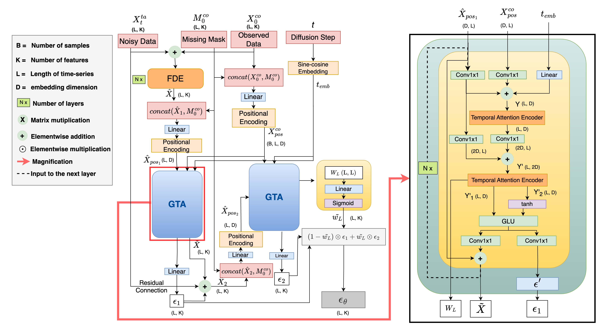

# SADI: Self-Attention-based Diffusion Model for Time-Series Imputation

This repository contains the implementation of **SADI (Self-Attention-based Diffusion Model for Time-Series Imputation)**, a state-of-the-art model designed to handle missing data in multivariate time-series datasets. SADI leverages feature and temporal correlations to provide high-quality imputation, outperforming existing models in both accuracy and efficiency.

## Introduction
SADI addresses the challenge of missing data in time-series datasets by explicitly modeling both feature and temporal dependencies. It introduces an innovative two-stage imputation process that enhances the accuracy of imputed values. This repository includes the code for training, evaluating, and experimenting with the SADI model.

*Figure 1: A diagram illustrating the methodology of the SADI approach.*

## Features
- **Self-Attention Mechanism**: Captures complex feature and temporal dependencies in time-series data.
- **Two-Stage Imputation Process**: Refines initial imputations to improve overall imputation quality.
- **Scalability**: Efficiently handles large datasets without compromising performance.
- **Flexible Missing Data Scenarios**: Includes support for random missing data and partial blackout scenarios.

## Requirements
- Python 3.8+
- PyTorch 1.8+
- NumPy
- Pandas
- Matplotlib

## GPU Resource used:
- Tesla V100-SXM3-32GB
- CUDA 11.3+

## Example code run
### For synthetic datasets:
Run `exe_synth_[dataset_name].py`

### For dataset AgAID:
Run `exe_agaid.py`

